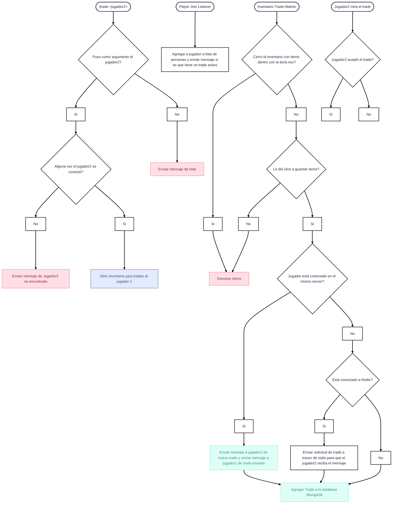

# Video: https://youtu.be/Lz2Fg1_H_yQ

# Phase 2 – Trade Plugin Submission

## Introduction

First of all, thank you very much for accepting me into **Phase 1** of the selection process. I truly appreciate the opportunity to be considered as a part of the **PrismaMC** team.

## About the Plugin

For this second phase, we were asked to develop a plugin. Although I joined a bit later than the rest of the candidates, I still gave my best effort to complete it.

This plugin was developed using **Purpur**, which supports the **MiniMessage** library natively. If you intend to run it on **Spigot**, please make sure to include the **MiniMessage** dependency to ensure full compatibility.

## Development Process

Before starting the actual implementation, I usually outline the core structure using **Mermaid** for better logic visualization. Initially, I attempted to create a complete Mermaid flow, which took a significant amount of time (almost an entire day, on **Monday, July 14th**). To save time, I later used a simplified base structure so I could focus on coding.

Here’s the logic flow of the plugin, represented in Mermaid:

## Technical Highlights
Designed to be fully asynchronous, ensuring performance and scalability.

Plugin is capable of handling multiple simultaneous trades.

Includes logic for cross-server trading, with a plan to use Redis for inter-server communication (the Redis event system was planned but not fully implemented due to time constraints).

Database interactions are optimized to avoid blocking the main thread.

## Limitations
Due to the short timeframe, I didn’t have the chance to perform extensive testing. Additionally, some messages and GUI-related polish remain incomplete. However, the core functionality and structure are in place and demonstrate a scalable, clean, and professional foundation.

## Final Notes
While this submission might not be 100% polished, I aimed to prioritize clean code, maintainability, and correct architectural decisions. I believe this reflects my potential as a developer.

Although GUI creation is not my strongest suit, I truly enjoy working at the packet level. I'm always open to learning new things, and if you give me the opportunity to be part of PrismaMC, I promise I will never let you down — whether for this or any future plugin you may need.

Thank you very much for reading.
Sincerely,
Mansitoh

--------------------------------------------
# Fase 2 – Envío del Plugin de Intercambio

## Introducción

Antes que nada, muchas gracias por haberme aceptado en la **Fase 1** del proceso de selección. Aprecio sinceramente la oportunidad de ser considerado para formar parte del equipo de **PrismaMC**.

## Sobre el Plugin

Para esta segunda fase se nos solicitó desarrollar un plugin. Aunque ingresé un poco más tarde que el resto de los participantes, me esforcé al máximo por cumplir con el objetivo a tiempo.

Este plugin fue desarrollado utilizando **Purpur**, el cual cuenta con soporte nativo para la librería **MiniMessage**. Si desean ejecutarlo en un servidor **Spigot**, es necesario incluir la dependencia de **MiniMessage** para asegurar su correcto funcionamiento.

## Proceso de Desarrollo

Antes de comenzar la implementación, normalmente estructuro la lógica principal del plugin utilizando **Mermaid**, lo cual me ayuda a visualizar el flujo completo. Al inicio, intenté crear una estructura detallada desde cero, lo cual me llevó casi un día entero (el **lunes 14 de julio**). Para optimizar el tiempo restante, utilicé luego una base más simplificada y así poder avanzar con el desarrollo.

A continuación, presento el flujo de lógica del plugin representado en Mermaid:

## Aspectos Técnicos Destacados
Diseñado para ser completamente asíncrono, asegurando rendimiento y escalabilidad.

Capaz de manejar múltiples intercambios simultáneos entre jugadores.

Incluye la lógica necesaria para permitir intercambios entre servidores, con planes de integración con Redis (esta parte quedó parcialmente pendiente por cuestiones de tiempo).

Las interacciones con la base de datos están optimizadas para evitar bloqueos del hilo principal.

## Limitaciones
Por cuestiones de tiempo, no tuve la posibilidad de realizar pruebas exhaustivas del plugin. Además, algunos mensajes y aspectos visuales (GUI) quedaron sin terminar. Aun así, la funcionalidad principal y la estructura base están correctamente implementadas y reflejan una base escalable, limpia y profesional.

## Notas Finales
Aunque esta entrega no está completamente pulida, prioricé la calidad del código, su mantenibilidad y una arquitectura adecuada. Considero que esto representa fielmente mi perfil como desarrollador.

Si bien mi fortaleza no está en el desarrollo de interfaces gráficas (GUI), realmente disfruto trabajar a nivel de paquetes. Siempre estoy abierto a seguir aprendiendo, y si se me brinda la oportunidad de formar parte de PrismaMC, les aseguro que no los defraudaré, ya sea para este plugin o para cualquier otro proyecto futuro.

Muchas gracias por su tiempo y lectura.
Atentamente,
Mansitoh