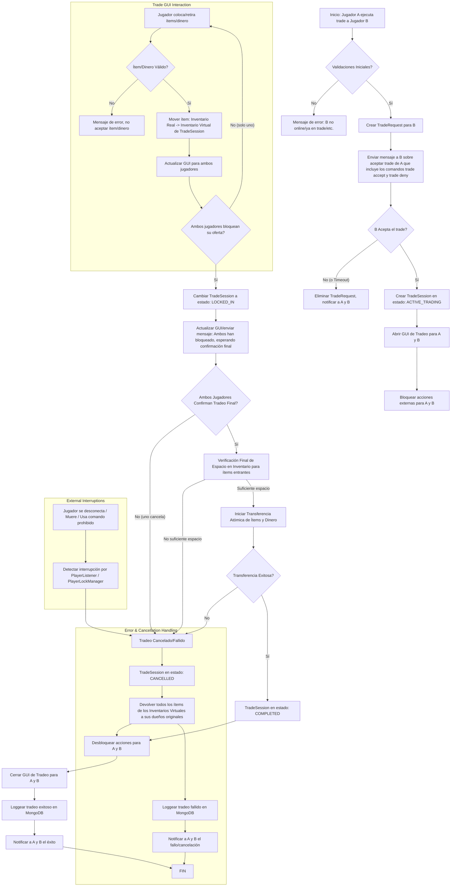

```mermaid
graph TD
    A[Inicio: Jugador A ejecuta trade a Jugador B] --> B{Validaciones Iniciales?};
    B -- No --> C[Mensaje de error: B no online/ya en trade/etc.];
    B -- Sí --> D[Crear TradeRequest para B];
    D --> E[Enviar mensaje a B sobre aceptar trade de A que incluye los comandos trade accept y trade deny];
    E --> F{B Acepta el trade?};
    F -- No (o Timeout) --> G[Eliminar TradeRequest, notificar a A y B];
    F -- Sí --> H[Crear TradeSession en estado: ACTIVE_TRADING];
    H --> I[Abrir GUI de Tradeo para A y B];
    I --> J[Bloquear acciones externas para A y B];
    
    subgraph Trade GUI Interaction
        K[Jugador coloca/retira ítems/dinero];
        K --> L{Ítem/Dinero Válido?};
        L -- No --> M[Mensaje de error, no aceptar ítem/dinero];
        L -- Sí --> N[Mover ítem: Inventario Real -> Inventario Virtual de TradeSession];
        N --> O[Actualizar GUI para ambos jugadores];
        O --> P{Ambos jugadores bloquean su oferta?};
        P -- No (solo uno) --> K;
    end

    P -- Sí --> Q[Cambiar TradeSession a estado: LOCKED_IN];
    Q --> R[Actualizar GUI/enviar mensaje: Ambos han bloqueado, esperando confirmación final];
    R --> S{Ambos Jugadores Confirman Tradeo Final?};
    S -- No (uno cancela) --> T[Cancelar TradeSession, iniciar Rollback];
    S -- Sí --> U[Verificación Final de Espacio en Inventario para ítems entrantes];
    U -- No suficiente espacio --> T;
    U -- Suficiente espacio --> V[Iniciar Transferencia Atómica de Ítems y Dinero];
    V --> W{Transferencia Exitosa?};
    W -- No --> T;
    W -- Sí --> X[TradeSession en estado: COMPLETED];
    X --> Y[Desbloquear acciones para A y B];
    Y --> Z[Cerrar GUI de Tradeo para A y B];
    Z --> AA[Loggear tradeo exitoso en MongoDB];
    AA --> BB[Notificar a A y B el éxito];
    BB --> C_END[FIN];

    subgraph Error & Cancellation Handling
        T[Tradeo Cancelado/Fallido] --> T1[TradeSession en estado: CANCELLED];
        T1 --> T2[Devolver todos los ítems de los Inventarios Virtuales a sus dueños originales];
        T2 --> Y;
        T2 --> T3[Loggear tradeo fallido en MongoDB];
        T3 --> T4[Notificar a A y B el fallo/cancelación];
        T4 --> C_END;
    end

    subgraph External Interruptions
        EIA[Jugador se desconecta / Muere / Usa comando prohibido] --> EI1[Detectar interrupción por PlayerListener / PlayerLockManager];
        EI1 --> T;
    end
```